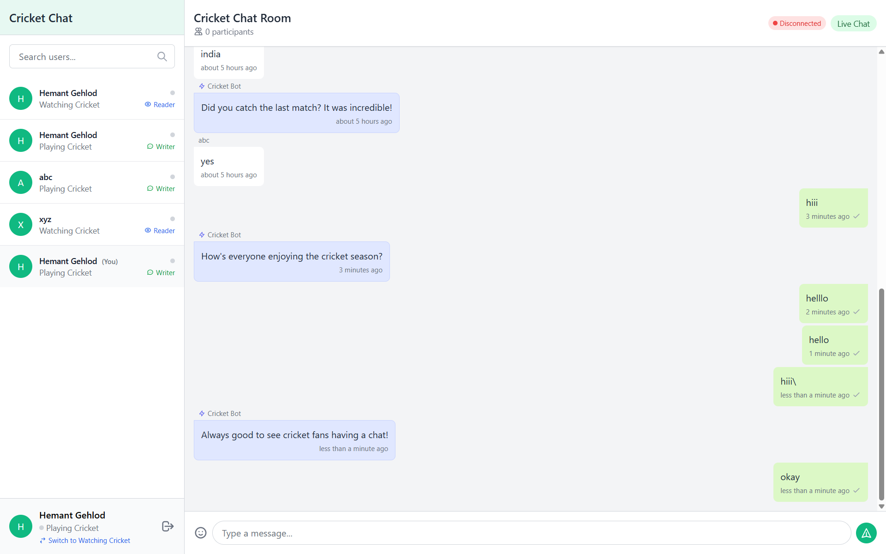

# Cricket Chat - WhatsApp Clone with Interest-Based Access Control

A real-time chat application built with MERN stack (MongoDB, Express, React, and Node.js) that implements role-based access control based on user interests.



## 🚀 Features

- **Authentication System**
  - User registration with name, email, and password
  - Secure login using JWT authentication
  - Password hashing with bcrypt

- **Interest-Based Role Control**
  - Users can select between "Playing Cricket" or "Watching Cricket" interests
  - Role-based access control:
    - "Playing Cricket" users can read and write messages
    - "Watching Cricket" users can only read messages

- **Real-time Chat Functionality**
  - WebSocket-based real-time messaging using Socket.IO
  - Message status indicators (sent, delivered, seen)
  - Typing indicators
  - Online status indicators
  - Cricket Bot that responds to messages

## 📋 Prerequisites

- [Node.js](https://nodejs.org/) (v14 or higher)
- [MongoDB](https://www.mongodb.com/)
- [Docker](https://www.docker.com/) (optional, for containerized deployment)

## 🛠️ Quick Start (Local Development)

### Clone the repository

```bash
git clone https://github.com/Hmtgit7/cricket-chat.git
cd cricket-chat
```

### Set up the Backend

```bash
# Navigate to the server directory
cd server

# Install dependencies
npm install

# Create a .env file based on the .env.example
cp .env.example .env
# Edit .env with your configuration

# Start the server
npm run dev
```

### Set up the Frontend

```bash
# Navigate to the client directory 
cd ../client

# Install dependencies
npm install

# Start the React development server
npm start
```

The application should now be running at http://localhost:3000

## 🐳 Deployment with Docker

We provide Docker configuration for easy deployment:

```bash
# Build and start all services
docker-compose up -d

# Stop all services
docker-compose down
```

The application will be available at http://localhost

## 🚢 Deployment to Render

This repository includes a `render.yaml` file for easy deployment to [Render](https://render.com):

1. Fork this repository to your GitHub account
2. In Render dashboard, click "New +" and select "Blueprint"
3. Connect your GitHub account and select this repository
4. Render will automatically create all required services
5. Once deployed, your application will be available at the provided URL

## 📁 Project Structure

```
cricket-chat/
├── client/                # React frontend
│   ├── public/            # Static files
│   ├── src/               # Source code
│   │   ├── components/    # React components
│   │   ├── contexts/      # Context providers
│   │   ├── pages/         # Page components
│   │   └── ...
│   ├── Dockerfile         # Frontend Docker configuration
│   └── ...
├── server/                # Node.js backend
│   ├── controllers/       # Route controllers
│   ├── middleware/        # Express middleware
│   ├── models/            # Mongoose models
│   ├── routes/            # API routes
│   ├── socket.js          # Socket.IO setup
│   ├── server.js          # Entry point
│   ├── Dockerfile         # Backend Docker configuration
│   └── ...
├── docker-compose.yml     # Docker Compose configuration
├── render.yaml            # Render deployment configuration
└── README.md              # This file
```

## 🔒 Role-Based Access Control Implementation

The application implements interest-based role control through several mechanisms:

1. **Database Level**: The User model includes an `interest` field that can be either "Playing Cricket" or "Watching Cricket".

2. **Authorization Middleware**: The `canWriteMessages` middleware checks if a user has the "Playing Cricket" interest before allowing them to send messages.

3. **UI Restrictions**: The chat input is disabled for "Watching Cricket" users with a clear message indicating their read-only status.

4. **Socket-Level Protection**: The Socket.IO server validates a user's interest before processing `new_message` events, providing double protection against unauthorized writes.

## 📚 API Documentation

The API documentation is available at `/api-docs` when running the server.

## 📝 License

This project is licensed under the MIT License - see the [LICENSE](LICENSE) file for details.

## 🙏 Acknowledgements

- [Socket.IO](https://socket.io/)
- [React](https://reactjs.org/)
- [Express](https://expressjs.com/)
- [MongoDB](https://www.mongodb.com/)
- [Tailwind CSS](https://tailwindcss.com/)